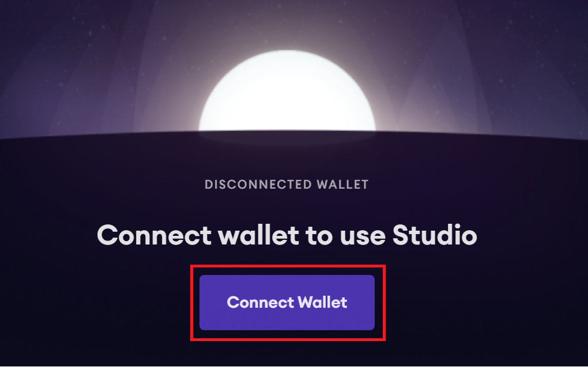
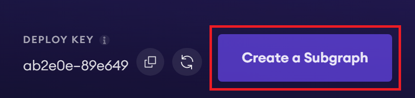
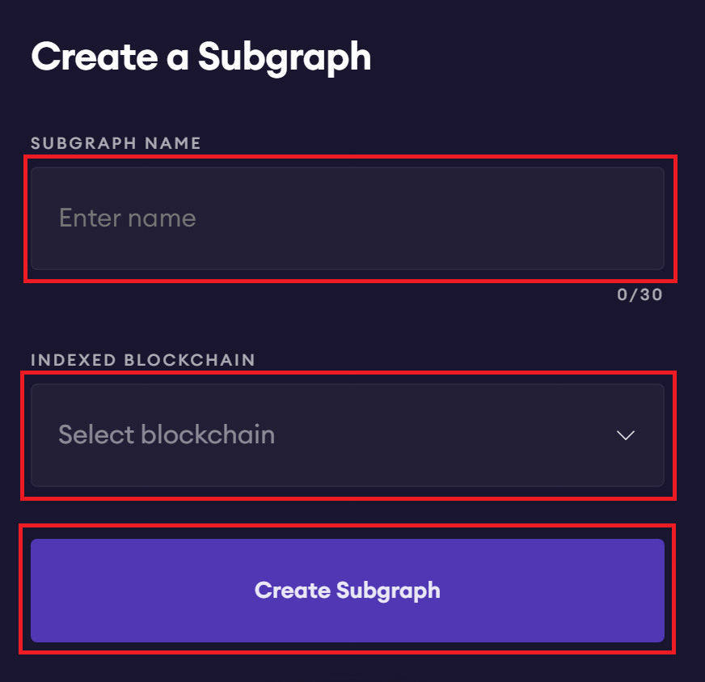
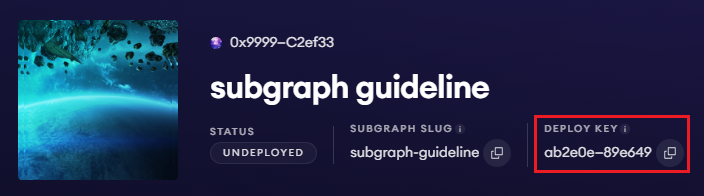

# SubGraph Deployment Guideline by Subgraph Studio

## Description

Deploy the subgraph with [Subgraph Studio](https://thegraph.com/studio/)

## Create a Subgraph in Subgraph Studio

**Step 1:** Access the **Dashboard** page [Subgraph Studio](https://thegraph.com/studio/) and connect to the wallet by click the `Connect Wallet` button.

<p align="center">
  
</p>

**Step 2:** Create a new subgraph by click to the `Create a Subgraph` button.

<p align="center">
  
</p>

**Step 3:** Set name of the subgraph and choose the network to be indexed by set `SUBGRAPH NAME` and choose `INDEXED BLOCKCHAIN`. Then click `Create Subgraph` to create new Subgraph.

- **SUBGRAPH NAME** - The name of the subgraph is created under, this will also define the `SUBGRAPH SLUG` name used for deployment and GraphQL endpoint. This field cannot be changed later.

- **INDEXED BLOCKCHAIN** - The blockchain network that your subgraph will be indexed.

<p align="center">
  
</p>

**Step 4:** Store the `DEPLOY_KEY` and `SUBGRAPH_SLUG`.  
After connecting to the wallet and create new subgraph, copy and store the deploy key and subgraph slug which is displayed on the dashboard:

<p align="center">
  
</p>

---

## Initialize Subgraph

**Step 1:** Pull code from Github.

**Step 2:** Install dependencies package:

```
yarn or npm install
```

**Step 3:** Setup file config with the network you want to deploy:

At the folder `./config`, create file `config.json` according to the following name rule:

File name = `<network_name>.json`

The **network_name** takes the list below:

**Mainnet:**

- `mainnet` (Ethereum)

- `matic`

- `optimism`

- `arbitrum-one`

- `zksync-era`

**Testnet:**

- `goerli`

- `mumbai`

- `optimism-goerli`

- `arbitrum-goerli`

- `zksync-era-testnet`

Then, set the following in your config file:

```
{
    "network": "<network_name>",
    "plp_address": "<plp_contract_address>",
    "plp_startBlock": "<init_block_of_plp_contract>",
    "plp_leverage_address": "<plp_leverage_contract_address>",
    "plp_leverage_startBlock": "<init_block_of_plp_leverage_contract>",
    "plp_moderator_address": "<plp_moderator_contract_address>",
    "plp_moderator_startBlock": "<init_block_of_plp_moderator_contract>",
    "blocks_per_day" : "<blocks_per_day>"
}
```

**Example:** Create file config mainnet.json that includes content:

```
{
    "network": "mainnet",
    "plp_address": "0x66c5F97df11f4C8AA01fB4eEaa341CfAc60d1796",
    "plp_startBlock": 40092028,
    "plp_leverage_address": "0xa26F380Dc9aadceAAeAcEd794c8be2E2D5C1f1f1",
    "plp_leverage_startBlock": 40092028,
    "plp_moderator_address": "0xb44021Ba8eb624b44bdF70D328C2441a8698c6A5",
    "plp_moderator_startBlock": 39264701,
    "blocks_per_day" : 7200
}
```

**Step 4:** Apply file config by running command:

```
yarn prepare:<network_name>
```

**Example:** Apply file config of `mainnet` network:

```
yarn prepare:mainnet
```

---

## Deploy to the Subgraph Studio

**Step 1:** Build the Subgraph:

```
graph codegen
graph build
```

**Step 2:** Authenticate and deploy your subgraph. The deploy key can be found on the Subgraph page in Subgraph Studio, or `<DEPLOY_KEY>` and `<SUBGRAPH_SLUG>` are stored at **Step 4** in the `Create a Subgraph in Subgraph Studio` part.

Run these CLI commands to deploy subgraph:

```
graph auth --studio <DEPLOY_KEY>
graph deploy --studio <SUBGRAPH_SLUG>
```

You will be asked for a version label. That said, you are able to choose any string as version such as: v1, version1, etc. However, it's strongly recommended to use semver for versioning like `0.0.1`. 

**Note:**

- Re-deploy new Subgraph with another network you should repeat the steps from the step 3 of the `Initialize Subgraph` part to the end.

- Re-deploy after testing completed at the same network you should repeat the steps in `Deploy to the Subgraph Studio` part. Have to name the version differently from the previous deployed versions.