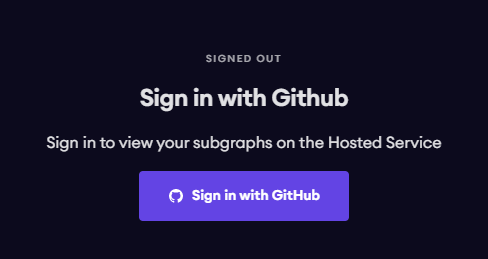

# SubGraph Deployment Guideline

## Description
Deploy the subgraph with [Subgraph Hosted Service](https://thegraph.com/hosted-service/)

> **Note:**
> Please note, the hosted service will begin sunsetting in 2023. Developers are encouraged to upgrade their subgraphs to [Subgraph Studio](https://thegraph.com/studio/) as more networks are supported. Details are in [here](https://thegraph.com/blog/sunsetting-hosted-service/).

## Quick start

**Step 1:** Access the **Dashboard** page: [Hosted Service](https://thegraph.com/hosted-service/dashboard) and sign in with Github account:

<p align="center">
  
</p>


**Step 2:** Store the `ACCESS_TOKEN`.  
After signing in with Github account, copy and store the access token displayed on the dashboard:

<p align="center">
  
</p>


**Step 3:** Pull code from Github.


**Step 4:** Install dependencies package:  
```
yarn
```
or 
```
npm install
```


**Step 5:** Create subgraph on **The Graph Explorer:**  

Back to **dashboard** page, click on the **Add Subgraph** button and fill in the information below as appropriate:

* **Subgraph Name** - Together with the account name that the subgraph is created under, this will also define the account-name/subgraph-name-style name used for deployments and GraphQL endpoints. This field cannot be changed later.

* **Account** - The account that the subgraph is created under. This can be the account of an individual or organization. Subgraphs cannot be moved between accounts later.

* **Subtitle** - Text that will appear in subgraph cards.

* **Hide** - Switching this on hides the subgraph in the Graph Explorer.

*(These are the four mandatory parameters we have to pay attention to)*

**Example:**

* **Subgraph Name:** PLP-Mainnet

* **Account:** Fringe

* **Subtitle:** PLP Mainnet

* **Hide:** true

From the above information, we will get **name_used_for_deployments** is `fringe/plp-mainnet`

After saving the new subgraph, you are shown a screen with help on how to install the Graph CLI, how to generate the scaffolding for a new subgraph, and how to deploy your subgraph.


**Step 6:** Setup **ACCESS_TOKEN**:

Back to **local project** and run this command with **ACCESS_TOKEN** taken above:
```
graph auth --product hosted-service <ACCESS_TOKEN>
```
This will store the access token on your computer. You only need to do this once.


**Step 7:** Setup file config with the network you want to deploy:

At the folder `./config`, create file `config.json` according to the following name rule:

File name = `<network_name>.json`

The **network_name** takes the list below:

**Mainnet:**

* `mainnet` (Ethereum)

* `matic`

* `optimism`

* `arbitrum-one`

* `zksync-era`

**Testnet:**

* `goerli`

* `mumbai`

* `optimism-goerli`

* `arbitrum-goerli`

* `zksync2-testnet`

Then, set the following in your config file:

```
{
    "network": "<network_name>",
    "plp_address": "<plp_contract_address>",
    "plp_startBlock": "<init_block_of_plp_contract>",
    "plp_leverage_address": "<plp_leverage_contract_address>",
    "plp_leverage_startBlock": "<init_block_of_plp_leverage_contract>",
    "plp_moderator_address": "<plp_moderator_contract_address>",
    "plp_moderator_startBlock": "<init_block_of_plp_moderator_contract>"
}
```

**Example:** Create file config mainnet.json that includes content:

```
{
    "network": "mainnet",
    "plp_address": "0x66c5F97df11f4C8AA01fB4eEaa341CfAc60d1796",
    "plp_startBlock": 40092028,
    "plp_leverage_address": "0xa26F380Dc9aadceAAeAcEd794c8be2E2D5C1f1f1",
    "plp_leverage_startBlock": 40092028,
    "plp_moderator_address": "0xb44021Ba8eb624b44bdF70D328C2441a8698c6A5",
    "plp_moderator_startBlock": 39264701
}
```


**Step 8:** Apply file config by running command:
```
yarn prepare:<network_name>
```

**Example:** Apply file config of `mainnet` network:
```
yarn prepare:mainnet
```


**Step 9:** Build Subgraph:
```
graph build
```


**Step 10:** Deploy Subgraph:
```
graph deploy --product hosted-service <name_used_for_deployments>
```

**name_used_for_deployments** taken from step 5

**Example:** Create file config mainnet.json that includes content:

*****Note:** Re-deploy new Subgraph with another network you want to deploy by looping steps 5 to step 10